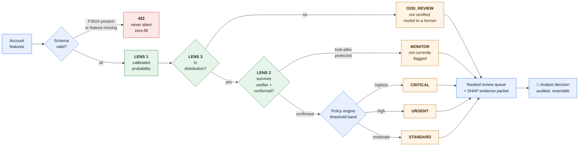
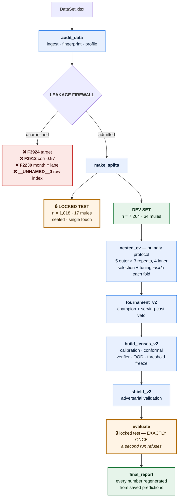

<div align="center">

# 🛡️ MuleGuard · Trinetra

### AI/ML Classification of Suspicious Mule Accounts

**Problem Statement 2 · PSB Cybersecurity, Fraud & AI Hackathon 2026**
**Bank of India × IIT Hyderabad**

**Team Kryptonite** · Hardik Hinduja · Avinash Gehi · Sahil Deshmukh · Siddharth Dey

> *Sees the mule. Spares the look-alike. Never certifies the unseen.*

<br/>

[](artifacts/metrics/verify_metrics.json)
[](docs/FINAL_RELEASE_GATE.md)
[](docs/ORGANISER_DRY_RUN.md)

[](artifacts/metrics/holdout_metrics.json)
[](artifacts/metrics/metric_battery.json)
[](artifacts/metrics/metric_battery.json)
[](artifacts/metrics/holdout_metrics.json)
[](artifacts/metrics/final_calibration.json)
[](artifacts/metrics/final_calibration.json)

[](pyproject.toml)
[](src/muleguard/api/main.py)
[](frontend/)
[](artifacts/metrics/promotion_decision_v2.json)
[](docs/NO_MCP_NO_BROWSER_AGENT_COMPLIANCE.md)
[](LICENSE)

</div>

---

## 📑 Table of Contents

| Section | Contents |
|---|---|
| [1. Problem Context](#1-problem-context) | PS2 scope, dataset, why this is hard |
| [2. Solution Overview](#2-solution-overview) | The Trinetra three-lens design |
| [3. System Architecture](#3-system-architecture) | End-to-end architecture diagrams |
| [4. Results](#4-results) | Locked test · dev OOF · nested CV · leakage story |
| [5. Repository Structure](#5-repository-structure) | Annotated directory tree |
| [6. Quick Start](#6-quick-start) | Install, one-command run, Docker |
| [7. Training Pipeline](#7-training-pipeline) | Full reproduction from raw data |
| [8. Testing & Verification](#8-testing--verification) | Every suite and what it proves |
| [9. API Reference](#9-api-reference) | Endpoints and hard guarantees |
| [10. Analyst Dashboard](#10-analyst-dashboard) | 12 screens, what each one shows |
| [11. Pre-registered Experiments](#11-pre-registered-experiments) | Decisions we tested, not asserted |
| [12. Engineering Guarantees](#12-engineering-guarantees) | Machine-enforced non-negotiables |
| [13. Known Limits](#13-known-limits) | Stated plainly, not rounded off |
| [14. Documentation Index](#14-documentation-index) | 86 reports, the ones that matter |

---

## 1. Problem Context

### 1.1 The task

Classify **suspicious mule accounts** from a flat, per-account behavioural snapshot —
identifying accounts likely used to receive and forward criminal proceeds, without
falsely condemning legitimate customers who happen to transact like mules.

### 1.2 The dataset

| Property | Value |
|---|---|
| Accounts | **9,082** |
| Raw columns | **3,925** |
| Confirmed mules | **81** |
| Prevalence | **0.8919%** (≈ 1 in 112) |
| Features in production | **120** (stability-selected, post-firewall) |
| Integrity | SHA-256 pinned; raw file never modified, never committed |

### 1.3 Why "accuracy" is the wrong metric — and has no badge here

> At **0.89% prevalence**, a model that flags **nobody** scores **≈99.1% accuracy while
> catching zero mules.** Accuracy is not merely unhelpful at this imbalance — it actively
> rewards the useless model.

This project therefore optimises and reports the **precision–recall family**: PR-AUC,
recall at realistic analyst alert budgets, precision inside each review tier, and
calibration quality — every figure carrying bootstrap 95% confidence intervals, and
every figure generated by the pipeline rather than typed by hand.

### 1.4 The three hard constraints

| Constraint | Consequence for the design |
|---|---|
| **Extreme imbalance** — 81 positives | Ranking metrics only; nested CV; no metric trusted from a single split |
| **Asymmetric cost** — a false accusation harms a real customer | Explicit look-alike protection; no automatic account freezing |
| **Unknown-unknowns** — the next mule pattern is not in the training set | Out-of-distribution routing; the model may abstain rather than guess |

---

## 2. Solution Overview

**Trinetra** ("three eyes") is not a metaphor for three models voting. It is three
*distinct failure modes*, each with its own dedicated defence, composed in sequence
and resolved by a deterministic policy engine that contains no ML and no LLM.

| | Lens | Failure it prevents | Mechanism |
|:--:|---|---|---|
| 👁️ | **DETECT** | Missing a real mule | XGBoost champion + LightGBM/CatBoost agreement · 120 stability-selected features · Platt-calibrated probability |
| 👁️ | **SPARE THE LOOK-ALIKE** | Condemning a legitimate customer | Hard-negative verifier · Mondrian conformal abstention · look-alike protection rule |
| 👁️ | **NEVER CERTIFY THE UNSEEN** | Silently passing a novel pattern | IsolationForest challenger · OOD detector · benign state means *"not currently flagged"*, never *"safe"* |

Every account exits through a **deterministic policy engine** that assigns one of five
review tiers. **The system never freezes an account by itself** — a freeze is a
*recommendation* requiring a named analyst plus a second approver, and the whole chain
is written to an append-only audit log.

---

## 3. System Architecture

### 3.1 End-to-end system

```mermaid
flowchart TB
    RAW["<b>DataSet.xlsx</b><br/>9,082 × 3,925 · immutable<br/>SHA-256 pinned"]

    subgraph GOV["🔒 GOVERNANCE — enforced before any model sees a column"]
        direction LR
        FW["<b>Feature Availability Firewall</b><br/>quarantine: F3924 · F3912<br/>F2230 · __UNNAMED__0"]
        SPL["<b>Split Manager</b><br/>locked test 1,818 · dev 7,264<br/>single-touch seal"]
    end

    subgraph ML["🧠 MODEL CORE — trained entirely behind the firewall"]
        direction LR
        SEL["Stability selection<br/>3,925 → 120 features"]
        TRN["Nested CV · 3×5 outer, 4 inner<br/>Optuna tuning inside each fold"]
        CAL["Platt calibration<br/>+ Mondrian conformal"]
    end

    subgraph LENS["👁️ TRINETRA — three lenses"]
        direction TB
        L1["<b>LENS 1 · DETECT</b><br/>XGBoost + LGBM/CatBoost agreement"]
        L2["<b>LENS 2 · SPARE THE LOOK-ALIKE</b><br/>hard-negative verifier · conformal abstention"]
        L3["<b>LENS 3 · NEVER CERTIFY THE UNSEEN</b><br/>IsolationForest · OOD detector"]
        L1 --> L2 --> L3
    end

    POL["<b>⚖️ DETERMINISTIC POLICY ENGINE</b><br/>no ML · no LLM · pure rules<br/>CRITICAL │ URGENT │ STANDARD │ OOD_REVIEW │ MONITOR"]

    subgraph SERVE["🚀 SERVING"]
        direction LR
        API["<b>FastAPI</b> :8001<br/>score · batch · file upload"]
        AUD["<b>Append-only audit</b><br/>SQLite triggers block<br/>UPDATE / DELETE"]
        SHAP["<b>TreeSHAP</b><br/>evidence packets"]
    end

    UI["<b>🖥️ React Dashboard</b> :5173<br/>12 screens · every number from an API field"]
    LLM["<b>🗣️ Ollama</b> — OPTIONAL, guarded<br/>narration only · validated · fallback<br/><i>cannot touch any score</i>"]
    HUM["<b>👤 HUMAN ANALYST DECIDES</b><br/>freeze = recommendation + 2nd approver"]

    RAW --> GOV --> ML --> LENS --> POL --> SERVE
    SERVE --> UI --> HUM
    LLM -.narrate only.-> UI

    classDef gov fill:#fff4e5,stroke:#b26a00,color:#3d2500,stroke-width:2px
    classDef ml fill:#e8f0fe,stroke:#1a73e8,color:#0b1f3a,stroke-width:2px
    classDef lens fill:#e6f4ea,stroke:#137333,color:#0b2b16,stroke-width:2px
    classDef pol fill:#fce8e6,stroke:#c5221f,color:#3d0b0a,stroke-width:3px
    classDef serve fill:#f3e8fd,stroke:#7627bb,color:#2a0b47,stroke-width:2px
    classDef opt fill:#f1f3f4,stroke:#9aa0a6,color:#202124,stroke-dasharray:5 3
    classDef data fill:#e0f7fa,stroke:#00697c,color:#00232a,stroke-width:2px

    class RAW data
    class FW,SPL gov
    class SEL,TRN,CAL ml
    class L1,L2,L3 lens
    class POL pol
    class API,AUD,SHAP,UI serve
    class LLM opt
    class HUM pol
```



### 3.2 Scoring path — what happens to a single account



### 3.3 Training & validation protocol



> **The local LLM cannot compute, alter, or influence any score, tier, threshold, or
> action.** Its output is machine-validated against the already-verified facts and
> discarded on any deviation — [15 guardrail cases, all passing](docs/FINAL_HALLUCINATION_GUARDRAIL_REPORT.md).
> Scoring is byte-identical with Ollama stopped, and there is an offline suite that proves it.

---

## 4. Results

The shipping model is **`xgboost_top_120`**, trained entirely behind the Feature
Availability Firewall. Every row below names **the split it was measured on**, because
the two splits do not agree — and pretending they do is how a leaderboard number
becomes a lie.

### 4.1 Locked test — sealed, single touch, natural prevalence

`n = 1,818 accounts · 17 mules · 0.94% prevalence`

| Metric | Value | Source |
|---|---|---|
| **PR-AUC** | **0.7263** | `artifacts/metrics/holdout_metrics.json` → `current_champion` |
| ROC-AUC *(secondary context only)* | 0.9665 | same |
| **Lift over prevalence** | **77.7×** | same |
| Recall @ top-25 alert budget | 70.6% — 12/17 mules at 48% precision | same |
| Recall @ top-100 | 82.4% — 14/17 mules | same |
| Seal integrity | SHA-256 sealed before reveal, re-hashed at reveal → **matched** | `artifacts/sealed_validation/` |

> ⚠️ With **17 positives**, this interval is wide by construction. It is a
> **single-touch sanity check on a frozen model — not the estimate to plan with.**

### 4.2 Development OOF — the estimate to plan with

3×5 repeated stratified CV, leakage-free v2 pool · `n = 7,264 · 64 mules · 0.881%`

| Metric | Value | Source |
|---|---|---|
| **PR-AUC** | **0.7690 ± 0.0266** · 95% CI **0.676 – 0.853** | `metric_battery.json` → `FLAT:xgboost_top_120` |
| ROC-AUC *(secondary context only)* | 0.9577 · CI 0.922 – 0.986 | same |
| **Recall @ top-25** | 39.1% at **100% precision** — 25 alerts, 25 true mules, **0 false positives** | same |
| Recall @ top-50 | 64.6% at 82.7% precision — 1.2 FP per 1,000 legitimate accounts | same |
| Recall @ top-100 | 78.1% at 50.0% precision — 2 reviews per mule caught | same |
| Calibration | Brier **0.00313** · ECE **0.00149** (10 uniform bins) · Brier skill vs base rate **0.642** | same |
| Single-account latency | p50 **0.31 s** · p95 **0.42 s** *(interactive budget 5 s)* | same → `operational` |
| Batch throughput | 688 rows/s, laptop CPU | same |
| No-skill baseline | 0.0088 | for scale |

### 4.3 Nested CV — the primary protocol, published unsmoothed

5-fold × 3 repeats outer, 4-fold inner selection and tuning:

| Family | PR-AUC (nested) | |
|---|---|---|
| **catboost** | **0.8065 ± 0.0084** | 🥇 |
| histgb | 0.7674 ± 0.0295 | 🥈 |
| **xgboost** — *the shipped family* | **0.7539 ± 0.0074** | 🥉 **← shipped** |
| lightgbm | 0.7005 ± 0.0236 | |
| extratrees · logistic · dummy | 0.5484 · 0.1639 · 0.0091 | |

> **The shipped family places third, and that is published rather than smoothed over.**

Paired on the same accounts in the same folds — not by eyeballing two overlapping
marginal intervals — CatBoost leads by **+0.0528 PR-AUC, 95% CI [0.0237, 0.0862]**,
which excludes zero. `muleguard.cli.nested_promotion` therefore records
`CHAMPION_CHALLENGED` and **exits non-zero**, deliberately failing the validation script.

**The bundle was not swapped.** Acting on it means re-fitting the calibrator and
conformal layer, re-freezing thresholds, and re-opening a locked test that is
single-touch by construction. The finding, the interval, and that bill are all in
[`NESTED_CV_MODEL_TOURNAMENT.md`](docs/NESTED_CV_MODEL_TOURNAMENT.md).

<details>
<summary><b>A correction we published against ourselves</b></summary>

The preliminary 1-repeat run scored 0.6679 for XGBoost, and this README once read that
as *"nesting costs roughly 0.10 PR-AUC"*. The finished run does not support it: nested
is **lower** than flat for xgboost (−0.015) but **higher** for catboost (+0.110), so the
flat protocol is not uniformly optimistic. In-fold tuning is not the explanation either
— that hypothesis was tested across all 15 outer folds and rejected
([`TUNING_OVERFIT_HYPOTHESIS.md`](docs/TUNING_OVERFIT_HYPOTHESIS.md)).
</details>

### 4.4 The leakage story — our audit found leaks the design document missed

| Run | Dev OOF PR-AUC | Status |
|---|---|---|
| LightGBM **clean** (quarantine enforced) | 0.614 ± 0.047 | ✅ honest baseline |
| XGBoost tuned, **120 post-firewall features** | **0.769 ± 0.027** | ✅ **shipped winner** |
| CatBoost, 60 features, **pre-firewall** | 0.808 ± 0.045 | ⛔ **RETIRED** — feature set contained quarantined columns |
| LightGBM **+ F3912** | 0.942 ± 0.012 | 🚫 **REJECTED — LEAKAGE**, kept as evidence only |

The retired row is the most flattering number this repository has ever produced, and it
is **wrong twice over**: it belongs to a model that is not deployed, and that model saw
quarantined features. It is kept visible on purpose — deleting it would make the drop
look like it never happened.
Full trace: [`HISTORICAL_METRIC_RECONCILIATION.md`](docs/HISTORICAL_METRIC_RECONCILIATION.md).

**Quarantined, each with measured evidence:**

| Column | Why it was quarantined |
|---|---|
| `F3924` | the target itself |
| `F3912` | \|corr\| **0.97**; single-feature CV PR-AUC **0.94** |
| `F2230` | snapshot month ≡ label — *all* 9,001 negatives are Oct-2025; *all* 81 positives are Sep/Nov/Dec |
| `__UNNAMED__0` | row index — the source file is physically sorted by label |

Evidence: [`FINAL_DATA_AND_LEAKAGE_AUDIT.md`](docs/FINAL_DATA_AND_LEAKAGE_AUDIT.md).

---

## 5. Repository Structure

```
BOI_hackathon/
│
├── 📄 run.sh                      One-command start — backend + frontend + health gates
├── 📄 Makefile                    make run · test · test-ml · release-test · …
├── 📄 pyproject.toml              Package definition, pinned toolchain
├── 📄 requirements.lock           Fully resolved dependency lock
├── 📄 docker-compose.yml          Two-service stack (api + frontend)
├── 📄 Dockerfile.api / .frontend  Container builds
│
├── 📁 configs/                    All tunables — nothing hard-coded in source
│   ├── base.yaml                    paths, seeds, compute mode
│   ├── data.yaml                    ingest + schema rules
│   ├── train.yaml                   model families, Optuna search spaces
│   ├── thresholds.yaml              frozen tier cut-offs, merchant safeguard mode
│   ├── feature_availability.yaml    firewall policy — what may reach a model
│   ├── leakage_quarantine.yaml      GENERATED — the quarantine manifest
│   ├── submission_format.yaml       organiser output contract
│   └── ollama.yaml                  optional LLM endpoint + guardrail config
│
├── 📁 src/muleguard/              Python package — 13 modules
│   ├── data/                        ingest · leakage firewall · profile · split      [5 files]
│   ├── features/                    fold-safe preprocessing · stability selection    [8 files]
│   ├── models/                      baselines · tuned cores · calibration · conformal
│   │                                hard-negative verifier · anomaly/OOD · bundle    [20 files]
│   ├── evaluation/                  honest metrics · bootstrap CIs · final plots      [4 files]
│   ├── explain/                     TreeSHAP reason codes · counterfactuals · packets [5 files]
│   ├── action/                      policy.py — deterministic 5-tier engine
│   │                                submission.py — organiser export                  [3 files]
│   ├── validation/                  sealed protocol · column mapping · validation lab [4 files]
│   ├── graph/                       counterparty graph adapter (ProofGraph)           [2 files]
│   ├── llm/                         guarded narrator + hallucination validator
│   │                                + deterministic fallback                          [6 files]
│   ├── monitoring/                  PSI / JS drift vs frozen baseline                 [2 files]
│   ├── api/                         main.py · routes_upload · routes_graph
│   │                                routes_capacity · routes_proofgraph
│   │                                routes_validation · append-only SQLite audit      [8 files]
│   └── cli/                         44 entry points: audit_env → audit_data →
│                                    make_splits → nested_cv → tournament_v2 →
│                                    build_lenses_v2 → shield_v2 → evaluate →
│                                    release_gate → final_report → export_submission
│
├── 📁 frontend/                   React 18 + TypeScript + Recharts (Vite)
│   └── src/
│       ├── pages/                   12 screens — Overview, AlertQueue, CaseDetail,
│       │                            ModelPerformance, FeatureIntelligence, DriftMonitoring,
│       │                            ModelCard, ValidationLab, BusinessValue,
│       │                            CapacityOptimizer, GraphLab, ProofGraph
│       ├── api.ts                   typed API client — the only data source
│       ├── components.tsx           shared primitives, loading/empty/error states
│       └── *.test.tsx               vitest suites incl. resolutions.test.tsx
│
├── 📁 tests/                      Python test suites
│   ├── unit/                        25 files — the bulk of coverage
│   ├── integration/                 4 files — API contract + end-to-end wiring
│   ├── model/                       leakage guards — fail the build if a
│   │                                quarantined column reaches a model
│   ├── security/                    2 files — injection, tamper, checksum
│   └── e2e/                         scenario suite A–J
│
├── 📁 scripts/                    Operational entry points
│   ├── verify_metrics.sh            ⭐ read-only re-derivation of every claim
│   ├── release_test.sh              canonical full release suite
│   ├── final_validation.sh          verify, or --full-retrain
│   ├── test_{all,ml,backend,frontend,e2e,security,offline}.sh
│   └── stop.sh · reconcile_history.py
│
├── 📁 artifacts/                  EVERY displayed number originates here
│   ├── metrics/                     metric_battery · nested_cv · holdout_metrics
│   │                                verify_metrics · calibration · capacity_curve
│   ├── predictions/                 saved OOF + locked-test prediction files
│   ├── models/                      final_bundle.joblib (SHA-256 signed)
│   ├── model_registry/              champion identity, promotion decisions, lineage
│   ├── features/                    selection frequency, stability traces
│   ├── plots/                       the 16 required evidence figures
│   ├── evidence/ · reports/         per-case evidence packets
│   ├── testing/                     all QA harness JSON outputs
│   ├── validation/ · splits/ · audit/ · experiments/
│   ├── release_manifest.json        what shipped, and its hashes
│   └── environment_snapshot.json    OS · Python · CUDA · RAM at run time
│
├── 📁 data/
│   ├── raw/                         immutable source (never committed)
│   ├── interim/ · processed/        parquet intermediates
│   └── splits/                      ✅ COMMITTED — locked test + CV fold definitions
│
├── 📁 docs/                       86 reports — see §14 for the ones that matter
└── 📁 deploy/                     nginx.conf for the container frontend
```

**Design rule enforced across the tree:** the dashboard and the reports are *readers*,
never authors. A number can only appear on screen if it exists in `artifacts/` first,
and `verify_metrics.sh` fails the build if any displayed figure disagrees with the
prediction file it claims to describe.

---

## 6. Quick Start

### 6.1 Prerequisites

```bash
# Python 3.11+ virtual environment with the project installed
python -m venv .venv
.venv/bin/python -m pip install -e ".[dev]"          # Linux / macOS
# .venv/Scripts/python -m pip install -e .[dev]      # Windows

# Frontend dependencies (Node 18+)
cd frontend && npm install && cd ..
```

Place `DataSet.xlsx` at the repository root. It is **never modified and never committed**.

### 6.2 One-command run

```bash
./run.sh            # or: make run
```

Starts backend and frontend, waits on **real health checks** — not a sleep — then prints:

```text
[run] MuleGuard - Trinetra is READY
[run]   Frontend:   http://localhost:5173
[run]   Backend:    http://127.0.0.1:8001
[run]   API docs:   http://127.0.0.1:8001/docs
[run]   Health:     http://127.0.0.1:8001/health/ready
[run]   Model:      xgboost_top_120 v2.0.0
[run]   Local LLM:  llama3.2:3b  (scoring never depends on it)
```

`Ctrl+C` stops everything cleanly.

| Variant | Effect |
|---|---|
| `./run.sh backend` | headless — API only |
| `API_PORT=8010 ./run.sh` | override the port |
| `./scripts/stop.sh` | stop everything |

Guide: [`ONE_COMMAND_RUN_GUIDE.md`](docs/ONE_COMMAND_RUN_GUIDE.md)

### 6.3 Docker

```bash
docker compose up --build
# frontend → http://localhost:5173     api → http://localhost:8001/docs
```

---

## 7. Training Pipeline

This is the **post-firewall (generation-2)** path — the one that produced the shipped
model. Generation-1 commands (`tournament`, `build_lenses`, `train baselines`) still
exist and still run, but their feature sets **predate the quarantine**, so their output
is evidence about the past, not a build step.

```bash
python -m muleguard.cli.audit_env                       # environment snapshot
python -m muleguard.cli.audit_data                      # ingest + fingerprint + firewall   (~10 min)
python -m muleguard.cli.make_splits                     # locked test + repeated stratified CV folds
python -m muleguard.cli.nested_cv --repeats 3 --inner 4 # PRIMARY protocol — selection + tuning in-fold (hours)
python -m muleguard.cli.nested_ses --stages all --n-jobs 2   # stability / ensembles / shift, all nested
python -m muleguard.cli.tournament_v2                   # champion selection + serving-cost veto
python -m muleguard.cli.advanced                        # TabPFN / TabICL / AutoGluon challengers
python -m muleguard.cli.build_lenses_v2                 # calibration + conformal + verifier + OOD + freeze
python -m muleguard.cli.shield_v2                       # adversarial validation + robustness shield
python -m muleguard.cli.evaluate                        # 🔒 LOCKED TEST — exactly ONCE
python -m muleguard.evaluation.plots_final              # the 16 required evidence figures
python -m muleguard.cli.demo --via-api                  # judge demo scenarios
python -m muleguard.cli.final_report                    # regenerate docs/FINAL_RESULTS.md
```

Or in a single command:

```bash
./scripts/final_validation.sh --full-retrain    # hours
./scripts/final_validation.sh                   # verify WITHOUT retraining — the judge-demo path
```

| Property | Guarantee |
|---|---|
| **Resumable** | Optuna SQLite study, per-model OOF replacement |
| **Seeded** | seed 42 everywhere |
| **Single-touch** | a second `evaluate` run **refuses** — the locked test is single-touch by construction |

---

## 8. Testing & Verification

### 8.1 The one command that checks the accuracy claims

```bash
bash scripts/verify_metrics.sh
```

No backend, no retraining, no locked-test access — a few minutes. It does **not print
stored numbers**; it **recomputes** them from the saved out-of-fold predictions and
fails if an artifact disagrees with the model it claims to describe.

<details>
<summary><b>The 10 checks, in order</b></summary>

1. Bundle signature — the served model is the one the registry signed
2. Champion identity, agreeing across three independent sources
3. PR-AUC re-derived from raw prediction files
4. Leakage firewall integrity
5. That no reported metric ever touched a locked-test row
6. Threshold ordering
7. Calibration
8. The 27-column comparison table
9. That every design decision has an experiment behind it
10. That any experiment which **beat** the shipped configuration is written up, rather than left in a file nobody opens

</details>

Output → [`verify_metrics.json`](artifacts/metrics/verify_metrics.json) ·
[`final_accuracy_table.csv`](artifacts/metrics/final_accuracy_table.csv)

### 8.2 All suites

| Command | What it runs |
|---|---|
| `bash scripts/verify_metrics.sh` | **Metric & accuracy verification** — the 10 checks above, the 27-column table, the experiment ledger, plus unit/integration/security tests. Read-only |
| `./scripts/release_test.sh` · `make release-test` | **Canonical full release suite** — all pytest + vitest + 10 live QA suites + ML release gate + report regeneration; non-zero exit on any failure |
| `./scripts/test_all.sh` · `make test` | Backend pytest + frontend vitest |
| `./scripts/test_ml.sh` · `make test-ml` | Unit + model leakage-guard tests + data/leakage QA harness |
| `./scripts/test_backend.sh` · `make test-backend` | API integration + live backend reliability harness |
| `./scripts/test_frontend.sh` · `make test-frontend` | vitest + production build |
| `./scripts/test_e2e.sh` · `make test-e2e` | Robustness suite + scenarios A–J, live |
| `./scripts/test_security.sh` · `make test-security` | Security pytest + live injection / tamper / checksum harness |
| `./scripts/test_offline.sh` · `make test-offline` | Guardrails with the LLM pointed at a dead port — **offline proof** |
| `python -m muleguard.cli.release_gate` | 23 ML release blockers (leakage, split overlap, metric trace, determinism, …) |
| `python -m muleguard.cli.qa_harness all` | All 10 live QA suites → `artifacts/testing/*.json` |

### 8.3 Current status — stated exactly as the artifacts report it

| Check | Result | Evidence |
|---|---|---|
| **Metric verification** | ✅ **10/10 PASS** (2026-08-14) | [`verify_metrics.json`](artifacts/metrics/verify_metrics.json) |
| **Organiser dry run** | ✅ **11/11 variants**, incl. 2 malformed payloads that must be *refused* | [`ORGANISER_DRY_RUN.md`](docs/ORGANISER_DRY_RUN.md) |
| **ML release gate** | ⚠️ **22/23** — 22 blockers CLEAR, `tests_pass` reported 1 failure in the last recorded full run | [`FINAL_RELEASE_GATE.md`](docs/FINAL_RELEASE_GATE.md) |

> The release-gate row is amber on purpose. The last recorded full-suite run
> (2026-08-13) shows every substantive blocker CLEAR — leakage, split overlap,
> single-touch, determinism, LLM isolation, no-auto-freeze, OOD routing, raw-data
> integrity — with one failing test inside `tests_pass`. **A green badge over an
> amber artifact is exactly the failure mode this project exists to avoid**, so the
> badge reads what the document reads until a clean full run replaces it.

---

## 9. API Reference

OpenAPI at **`/docs`**.

| Endpoint | Purpose |
|---|---|
| `GET /health/live` · `GET /health/ready` | Liveness / model-loaded readiness — reports Ollama as **optional** |
| `GET /v1/model` | Model manifest: version, SHA-256, features, calibrator, git commit |
| `POST /v1/score` | Score one account → calibrated risk, tier, agreement, conformal, OOD, SHAP reasons |
| `POST /v1/score/batch` | Up to 500 accounts per request |
| `POST /v1/score/file` | **CSV/XLSX upload** → scored CSV download — 60 MB cap, formula-injection-safe, target column safely ignored |
| `GET /v1/cases` · `GET /v1/cases/{id}` | Ranked review queue / full case detail |
| `POST /v1/cases/{id}/decision` | Analyst action — actor + reason required; a freeze recommendation needs a 2nd approver |
| `POST /v1/cases/{id}/feedback` | Verdicts (CONFIRMED_MULE / FALSE_POSITIVE / INCONCLUSIVE) → retraining queue |
| `GET /v1/metrics/summary` | Dashboard numbers **served from artifacts** — the UI can never invent a metric |
| `GET /v1/drift/status` | PSI drift status vs frozen baseline |
| `POST /v1/reports/{id}/generate` | Evidence packet — deterministic, or guarded-LLM narrative when Ollama is up |

### 9.1 Hard guarantees

| Guarantee | Behaviour |
|---|---|
| Leakage refusal | `F3924` in a request → **422** |
| No silent imputation | Missing selected feature → **422 SCHEMA_ERROR**, never a silent zero-fill |
| Determinism | Identical input → identical output |
| Immutable audit | Append-only events; SQLite triggers block `UPDATE` and `DELETE` |

### 9.2 Merchant legitimacy safeguard — and the guarantee it nearly broke

A legitimate high-volume merchant looks like a mule on raw throughput. The safeguard
runs in one of two modes, read from `configs/thresholds.yaml`:

- **MODE A · `CONFIDENCE_ONLY` (shipped default)** — records a merchant verdict on every
  scored record and **changes no score and no tier**. Inert by construction: in this mode
  the safeguard never sets its applied flag, so routing falls through to the measured
  score untouched.
- **MODE B · `BOUNDED_DAMPENING`** — dampens by 0.85 with a hard floor at 0.70 of the
  original score; every record carries `before_score` alongside the result.

> **A real defect, stated rather than buried.** Wiring MODE B surfaced it: on a 600-row
> check, one `STANDARD_REVIEW` account dampened all the way into `MONITOR` — **removing
> it from the review queue**, directly contradicting the guarantee printed on the
> safeguard's own record. It is now capped: MODE B may lower a case's priority, **never
> its right to be looked at**. The dampened score still appears in the record, so the cap
> is exactly as auditable as the dampening was.
>
> Measured on 600 rows: **111 dampenings · 3 tier changes** (all priority reductions
> *inside* review) · **0 queue exits**.

---

## 10. Analyst Dashboard

White background, black text, 12 screens — 10 in the primary navigation plus two detail
routes.

| Screen | What it shows |
|---|---|
| **Executive Overview** | Tiers, budgets, calibration, drift, live queue |
| **Alert Queue** | Ranked, filterable review queue |
| **Case Detail** | SHAP drivers vs legitimate-cohort percentiles, model comparison, analyst actions, evidence export, LLM/deterministic narrative with a source badge |
| **Model Performance** | PR curve with CI, calibration, tournament including the **red REJECTED-LEAKAGE bar**, recall@FPR, tier precision |
| **Feature Intelligence** | Selection frequency, quarantine panel, verified-semantics registry |
| **Drift & Monitoring** | PSI, champion/challenger governance |
| **Model Card** | The full card, served from artifacts |
| **Validation Lab** | Sealed-protocol and column-mapping validation |
| **Business Value** | Impact Simulator — analyst capacity, review minutes, exposure per confirmed mule |
| **Analyst Capacity** | Capacity-optimiser curves |
| **Graph Lab** | Counterparty graph adapter |
| **ProofGraph** | Evidence graph with one-click JSON download |

**Every page implements loading / empty / error states.** With the API down you see an
explicit error — never fake numbers, never a blank screen.

<details>
<summary><b>Two deliberate design decisions worth defending out loud</b></summary>

**The ProofGraph download re-requests the API and saves the response bytes unparsed**,
so the downloaded file is the server's graph — not a re-serialisation of React state
that could drift from it.

**The Impact Simulator is the one deliberate exception to "every number is an API
field"**, and it is labelled as such on screen: a `user-entered assumptions, not
measured facts` badge, every card marked *measured —* or *your assumption —* with its
arithmetic printed, and a "What this is not" row. Analyst capacity is **snapped to the
largest measured budget at or below the entered value** — never interpolated. It refuses
to answer below the smallest measured budget, and says so rather than extrapolating
above the largest.
</details>

**Layout** is verified at **1280×720, 1366×768, 1440×900 and 1920×1080**
(`frontend/src/resolutions.test.tsx`). That suite also asserts that **no source file
branches on `innerWidth`/`matchMedia`** — so CSS is the only responsive mechanism — and
that no declared width exceeds the content column. It states plainly in its own header
that **jsdom does not lay out**, so pixel overlap is *not* measured there; what is
measured is render completeness, the absence of width-conditional JS, and the declared
layout rules.

---

## 11. Pre-registered Experiments

Three design positions in this repository were once defended with reasoning alone. Each
is now an experiment with a **decision rule fixed before the run**, scored on the **same
15 nested outer folds** (3 repeats × 5 folds, 4 inner), with **all three paired tests
reported** — because they can disagree, and a disagreement is information, not something
to pick from.

| Question | Arms | Verdict | Evidence |
|---|:--:|---|---|
| Does admitting a protected attribute improve detection? | 8 | **`KEEP_EXCLUSION`** | [`FAIRNESS_VALIDATION.md`](docs/FAIRNESS_VALIDATION.md) |
| Does resampling beat class weights on 81 positives? | 7 | **`KEEP_BASELINE`** | [`smote_ablation.json`](artifacts/metrics/smote_ablation.json) |
| Is 120 the right feature count? | 11 | ⚠️ **open finding — 200 wins** | [`FEATURE_SUBSET_SIZE_FINDING.md`](docs/FEATURE_SUBSET_SIZE_FINDING.md) |

### 11.1 Fairness — what the exclusion actually costs

`F3892 GENDER` is excluded by policy. The obvious challenge is *"you excluded it on
principle — what did it cost you?"* Until this run, we could not answer.

**It costs −0.00011 PR-AUC.** That is the `sensitive_excluded` control: sign test
p = 1.000, and the selected feature pool differs from baseline in **1 of 15 folds**. The
selector barely wanted these columns at all — occupation was never ranked in any fold,
area ranked once at position 514, age reached the top 120 exactly once.

And the central result: **forcing gender in makes the model *worse*, −0.00481.**

| Arm | Paired diff | sign p | up/down/tied |
|---|---:|---:|:--:|
| `sensitive_excluded` | −0.00011 | 1.000 | 0/1/14 |
| `age_forced` | **+0.00150** | 0.424 | 9/5/1 |
| `all_four_forced` | −0.00122 | 1.000 | 8/7/0 |
| `occupation_forced` | −0.00449 | 0.118 | 4/11/0 |
| `gender_forced` | **−0.00481** | 0.118 | 4/11/0 |
| `geography_forced` | −0.00503 | **0.035** | 3/12/0 |
| `sensitive_forced` | −0.00553 | 0.302 | 5/10/0 |

Two rows are deliberately awkward and are flagged rather than buried. `age_forced` is
the only positive mean — and its sign test is p = 0.42 with a CI spanning zero four
times over, so **we do not claim it**. `geography_forced` has a **significant** sign test
at 0.035 — with a **negative** mean, making it evidence *against* geography, not for it.
Every arm also publishes its **MDE80** (0.0003–0.010), so "no effect detected" cannot be
misread as "no effect".

### 11.2 Resampling — the argument we had been making without evidence

Verdict **`KEEP_BASELINE`** — but the honest reading is *not* "SMOTE is bad". Every SMOTE
ratio came out **slightly positive** (+0.005 to +0.012 AP) and simply failed the
pre-registered sign test. The control decides it: plain random duplication buys +0.005 on
its own, so synthesising points beyond re-weighting is worth about **+0.007 against a
±0.10 fold spread**. Undersampling is the one unambiguous result: **−0.134, p = 0.0001**.

**Two disclosures.** `smote_0.10` *does* reject on Wilcoxon (p = 0.010) while failing the
sign test (p = 0.12) — the sign test was named before the run, so it stands rather than
being swapped for the test that reads better. And this ablation scored **ranking only**:
the calibration argument our own docs give for rejecting SMOTE was **not** measured here,
so we do not claim it as a finding.

> Until 2026-08-14, `docs/COMPETITOR_GAP_MATRIX.md` said *"we tested resampling and
> rejected it"* when no such test had been run. It was an assertion. It is now a result,
> and the sentence was corrected rather than quietly left standing.

---

## 12. Engineering Guarantees

All machine-enforced — each one fails the build if violated.

| | Guarantee |
|:--:|---|
| ✅ | **No leakage** — `F3924`/`F3912`/`F2230`/index quarantined; tests fail the build if any enters a model |
| ✅ | **Locked test touched exactly once** — sentinel log; re-runs refuse |
| ✅ | **Natural prevalence everywhere** — no SMOTE in the accepted model, backed by a 7-arm ablation (`KEEP_BASELINE`) rather than by assertion |
| ✅ | **Protected attributes excluded, and the cost measured** — gender never reaches the frame; the 8-arm ablation prices the exclusion at −0.0001 AP and shows gender *hurts* (−0.0048) |
| ✅ | **The firewall's second line of defence is whole** — `assert_clean` refuses all 13 manifest columns. It refused only 9 until 2026-08-14; nothing had leaked, and the gap is **documented rather than silently patched** |
| ✅ | **No automatic freezing** — review tiers only; a freeze is a recommendation + analyst + 2nd approver, fully audited |
| ✅ | **Never "guilty", never "certified safe"** — behavioural risk ≠ intent; the benign state is *"not currently flagged, monitoring continues"* |
| ✅ | **The LLM cannot touch a score** — validated narration, deterministic fallback; scoring is identical with Ollama stopped |
| ✅ | **No MCP · no browser agents · no internet** required — fully local, verified by scan + offline suite |
| ✅ | **Every displayed metric traces to a saved prediction file** — recomputed and asserted at gate time |

---

## 13. Known Limits

Stated plainly, because a limit found by a judge is worse than a limit we published.

### 13.1 Structural

- **17 locked-test positives** → wide confidence intervals. Reported, never hidden.
- **Flat per-account snapshot** → no counterparty graph, **no ring-detection claims** (roadmap).
- **Sleeper mules are invisible** before activation.
- **Negatives are a single-month snapshot** — label-trust caveat documented.
- **Out-of-time testing is impossible on this file** — time ≡ label. Documented instead of faked.

### 13.2 Fairness caveats we will not round off

The slice audit reports **10 female positives and 3 in the unrecorded-gender bin** — no
slice conclusion at those counts is stable. The M/F recall gap (0.863 vs 0.700) is 44/51
against 7/10, where **a single additional miss moves the figure by 10 pp**. It is
monitored, not explained.

The most actionable line in that table has nothing to do with gender: the
**"(not recorded)" group has the lowest selection rate of any group and recall 0.000 in
every arm.** One row in the extract has a **negative age**, counted explicitly so its bin
does not hide it. And the ablation measures **ranking and slice rates only** —
calibration-within-group and equalised odds are **not** tested.

**Neither ablation is a licence to stop looking.** `F3890`/`F3891`/`F3894` remain
admissible, so a future retrain could select one and make a demographic the top SHAP
contributor with nothing in the pipeline objecting — there is no check requiring a
corroborating non-demographic reason. That gap is documented with the remedy named.

### 13.3 Open finding, not yet acted on

A same-model, same-fold sweep either side of the shipped feature count says **200
features beat the shipped 120** by a paired **+0.024 AP** (0.80577 vs 0.78161; sign
0.035, Wilcoxon 0.008, paired-t 0.010 over 15 folds).

Acting on it is a full retrain — selection, calibration, bundle, thresholds, and every
artifact quoting 0.76904 — so **the champion is unchanged and every number above still
describes a model that actually exists.** Written up in
[`FEATURE_SUBSET_SIZE_FINDING.md`](docs/FEATURE_SUBSET_SIZE_FINDING.md), and
`verify_metrics.sh` **fails if that write-up ever stops naming the winning arm**.

---

## 14. Documentation Index

86 reports live in [`docs/`](docs/). These are the ones that matter:

### 14.1 Results & validation

| Document | Contents |
|---|---|
| [`FINAL_RESULTS.md`](docs/FINAL_RESULTS.md) | Every measured number, with CIs |
| [`FINAL_RELEASE_TEST_REPORT.md`](docs/FINAL_RELEASE_TEST_REPORT.md) | The full release verdict and its evidence |
| [`FINAL_RELEASE_GATE.md`](docs/FINAL_RELEASE_GATE.md) | The 23 release blockers, one by one |
| [`FINAL_DATA_AND_LEAKAGE_AUDIT.md`](docs/FINAL_DATA_AND_LEAKAGE_AUDIT.md) | The three-leak story |
| [`FINAL_ACCURACY_AND_MODEL_SELECTION_REPORT.md`](docs/FINAL_ACCURACY_AND_MODEL_SELECTION_REPORT.md) | Tournament and selection rationale |
| [`TRINETRA_LENS_REPORT.md`](docs/TRINETRA_LENS_REPORT.md) | The three lenses in depth |

### 14.2 The experiments that tested our own positions

| Document | What it challenges |
|---|---|
| [`NESTED_CV_MODEL_TOURNAMENT.md`](docs/NESTED_CV_MODEL_TOURNAMENT.md) | The run in which **our own shipped family places third** |
| [`FEATURE_SUBSET_SIZE_FINDING.md`](docs/FEATURE_SUBSET_SIZE_FINDING.md) | The sweep saying **our shipped feature count is too small** |
| [`FAIRNESS_VALIDATION.md`](docs/FAIRNESS_VALIDATION.md) | 8-arm sensitive-attribute ablation, with MDE80 per arm |
| [`FEATURE_AVAILABILITY_AUDIT.md`](docs/FEATURE_AVAILABILITY_AUDIT.md) §8.1 | A hole in the firewall's second line of defence — found and closed |
| [`HISTORICAL_METRIC_RECONCILIATION.md`](docs/HISTORICAL_METRIC_RECONCILIATION.md) | Why the most flattering number in this repo was retired |
| [`TUNING_OVERFIT_HYPOTHESIS.md`](docs/TUNING_OVERFIT_HYPOTHESIS.md) | A hypothesis of ours, tested and rejected |

### 14.3 Operations & demo

| Document | Contents |
|---|---|
| [`JUDGE_QA.md`](docs/JUDGE_QA.md) | 18 prepared answers |
| [`DEMO_SCRIPT.md`](docs/DEMO_SCRIPT.md) | 7-scene, 5–7 minute demo |
| [`ORGANISER_DRY_RUN.md`](docs/ORGANISER_DRY_RUN.md) | 11 input variants, incl. 2 malformed payloads that must be refused |
| [`MODEL_CARD.md`](docs/MODEL_CARD.md) | The model card |
| [`DEPLOYMENT_GUIDE.md`](docs/DEPLOYMENT_GUIDE.md) | Production deployment |
| [`ONE_COMMAND_RUN_GUIDE.md`](docs/ONE_COMMAND_RUN_GUIDE.md) | Run-script reference |

---

<div align="center">

### 🛡️ MuleGuard · Trinetra

**Team Kryptonite** · Problem Statement 2
**PSB Cybersecurity, Fraud & AI Hackathon 2026 · Bank of India × IIT Hyderabad**

*Sees the mule. Spares the look-alike. Never certifies the unseen.*

<br/>

All dataset figures and model results were computed by this pipeline on the provided
dataset. Performance is reported only from our own cross-validation and a single-touch
locked test. No number in this document was typed by hand.

[](LICENSE)

</div>
